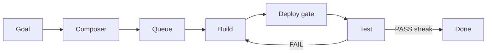

# Ratchet system guide (v1.2)

**Pack version:** v1.2 — shareable documentation pack (neutral illustrative paths, no secrets)

**What this is:** documentation for a self-hosted **AI build-and-verify control plane**. A human types a goal; the system drafts missions, runs an AI builder and AI tester in a loop against a real git repo and a **live** deploy, and only finishes when acceptance criteria pass — and keep passing.
**Who it’s for**

- Friends who want to understand or rebuild the system
- Coding agents you point at this folder (“build me this”)
- Humans returning to the design without chat history

**What is not here**

- API keys, vault master passwords, edge passwords, consumer keys
- Private host credentials
- Day-to-day host operations runbooks (process-manager recipes, SSH production ops, heal timers)

Reference layout in this pack uses the placeholder root **`RATCHET_ROOT/{control,harness,projects}`**. Rename freely when rebuilding — these are not a real host’s paths.

---

## Start paths

| Goal                         | Open                                                                                        |
| ---------------------------- | ------------------------------------------------------------------------------------------- |
| **Print one sheet / PDF**    | [`one-pager-print`](./one-pager-print) (File → Print) · or [`one-pager.md`](./one-pager.md) |
| **All diagrams**             | [`diagrams.md`](./diagrams.md)                                                              |
| **What changed in the docs** | [`CHANGELOG.md`](./CHANGELOG.md)                                                            |
| **Point an AI at rebuild**   | [`ai-prompts.md`](./ai-prompts.md) section A                                                |

---

## Read order

| #   | File                                                                  | Contents                                           |
| --- | --------------------------------------------------------------------- | -------------------------------------------------- |
| 1   | [overview.md](./overview.md)                                          | Elevator pitch, flow diagram, component table      |
| 2   | [architecture.md](./architecture.md)                                  | System map, trust boundaries, data flow            |
| 3   | [principles.md](./principles.md)                                      | Design rules (live is truth, proof-of-work, …)     |
| 4   | [layout.md](./layout.md)                                              | Directory trees, env files, `project.json`         |
| 5   | [loop-and-missions.md](./loop-and-missions.md)                        | Ratchet loop, mission YAML, exit codes, `/version` |
| 6   | [composer.md](./composer.md)                                          | Build UI, queue, assist, admin, header nav         |
| 7   | [lazy-medic-sentinel.md](./lazy-medic-sentinel.md)                    | Overnight watchdogs and recovery                   |
| 8   | [vault.md](./vault.md)                                                | Credentials, consumer broker, Railway actions      |
| 9   | [projects-and-deploy.md](./projects-and-deploy.md)                    | Product shells, git identity, host deploys         |
| 10  | [operations.md](./operations.md)                                      | Runtime services overview (roles, edge sketch)     |
| 11  | [rebuild.md](./rebuild.md)                                            | Greenfield checklist (phases A–E)                  |
| 12  | [ai-prompts.md](./ai-prompts.md)                                      | Coding / debug / new-product prompts               |
| 13  | [footguns.md](./footguns.md)                                          | Failure modes and fix directions                   |
| 14  | [examples.md](./examples.md)                                          | Mock loop, full loop, sample product campaign      |
| —   | [diagrams.md](./diagrams.md)                                          | Mermaid gallery                                    |
| —   | [one-pager-print](./one-pager-print) / [one-pager.md](./one-pager.md) | Printable sheet                                    |
| —   | [CHANGELOG.md](./CHANGELOG.md)                                        | Guide pack history                                 |

---

## One-sentence mental model

**Composer** turns intent into queued missions. **Ratchet** is the factory floor (build → deploy gate → test → repeat). **Vault** holds keys the floor needs without giving them to the robots. **Lazy / Medic / Sentinel** keep the factory from catching fire overnight. Every product must tell the truth at **`/version`**.

---

## Pack scope

This multi-file pack is the portable public guide. Prefer it for rebuilds and sharing. It intentionally excludes private install notes and host-specific operations material.
