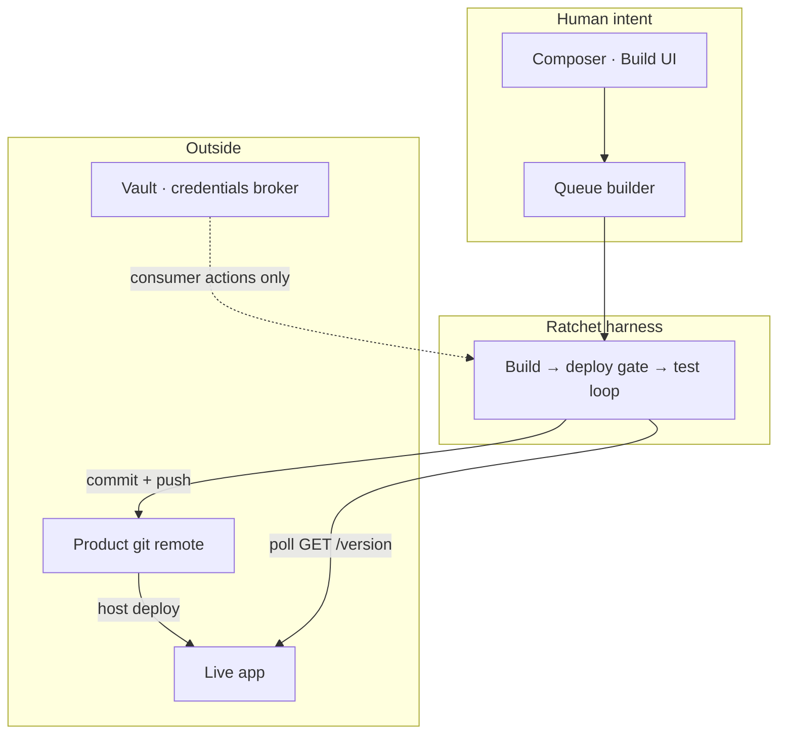
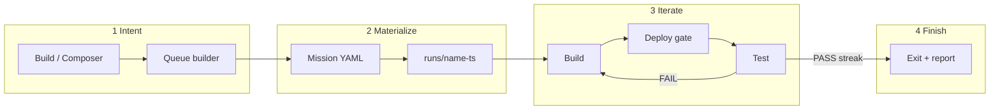

# Architecture

← [Overview](./overview.md) · [Index](./README.md) · Next: [Principles](./principles.md)

---

## System map



ASCII fallback:

```
Human goal → Composer → Queue → Ratchet harness
                                  ├→ push product repo
                                  ├→ wait for live /version
                                  └→ test live_url only
```

Gallery: [diagrams.md](./diagrams.md)

---

## Trust boundaries

| Zone | Who | Trust rules |
| ---- | --- | ----------- |
| **Human + Composer** | Operator | Privileged UI for goals, projects, and queues |
| **Builder workspace** | Coding agent CLI | Can edit the product repo; **no** vault secrets in env |
| **Tester workspace** | Tester CLI | Prefer read-only; only **live_url**, not the local builder tree as truth |
| **Vault consumer** | Harness | Short-lived arm + key file; never log secret values |
| **Product live** | Public users | Must expose `/version` so the deploy gate can wait on truth |

Secrets stay out of agent prompts and builder/tester environments. The harness may use a consumer path to request named broker actions; tokens never land in the builder env.

---

## End-to-end data flow



### 1. Intent capture

1. Human opens Build or Composer.
2. Types a goal (optional image attachments on Build).
3. **Queue builder** turns prose into one or more queue items scoped to a **project folder**.

### 2. Mission materialization

1. Queue item → mission YAML (name, repo, live_url, acceptance, models, limits).
2. Optional architect / provision steps may consult Vault for infra (prefer off until the core loop is solid).
3. Run directory created: `runs/<name>-<timestamp>/`.

### 3. Loop iteration

1. **Build** — agent works in `builder/` checkout; commits; pushes `deploy.branch`.
2. **Deploy gate** — poll `live_url` + `version_endpoint` until SHA matches (or fixed-delay / command strategy).
3. **Test** — agent exercises live site; writes `shared/verdict.json`.
4. **PASS** → streak++; **FAIL** → streak=0, next build prompt = tester’s `builder_prompt`.

### 4. Completion

1. Exit code + `shared/report.md` + cost JSON.
2. Queue item marked succeeded / failed / hard-fail.

---

## Adapter matrix

The harness roles are pluggable:

```yaml
adapters: mock # all simulated
# or
adapters:
  builder: real
  tester: real
  deploy: real
```

| Role | Mock | Real (typical) |
| ---- | ---- | -------------- |
| builder | scripted “work” | Coding CLI + git proof-of-work |
| deploy | instant / scenario | version-endpoint / fixed-delay / command |
| tester | scenario file line N | Tester CLI against live_url + verdict |

Mix roles while rolling out (e.g. real builder + mock tester).

---

## Where product state lives

Paths use the illustrative root `RATCHET_ROOT` — rename to match your install.

| State | Location |
| ----- | -------- |
| Queue items | `RATCHET_ROOT/harness/composer-queue/<folder>-*.json` |
| Run workspaces | `RATCHET_ROOT/harness/runs/<name>-<ts>/` |
| Mission templates / seeds | `RATCHET_ROOT/harness/missions/` |
| Project shells | `RATCHET_ROOT/projects/<slug>/project.json` |
| Vault ciphertext | vault-mode `data/` (gitignored) |

Continue → [Principles](./principles.md)
