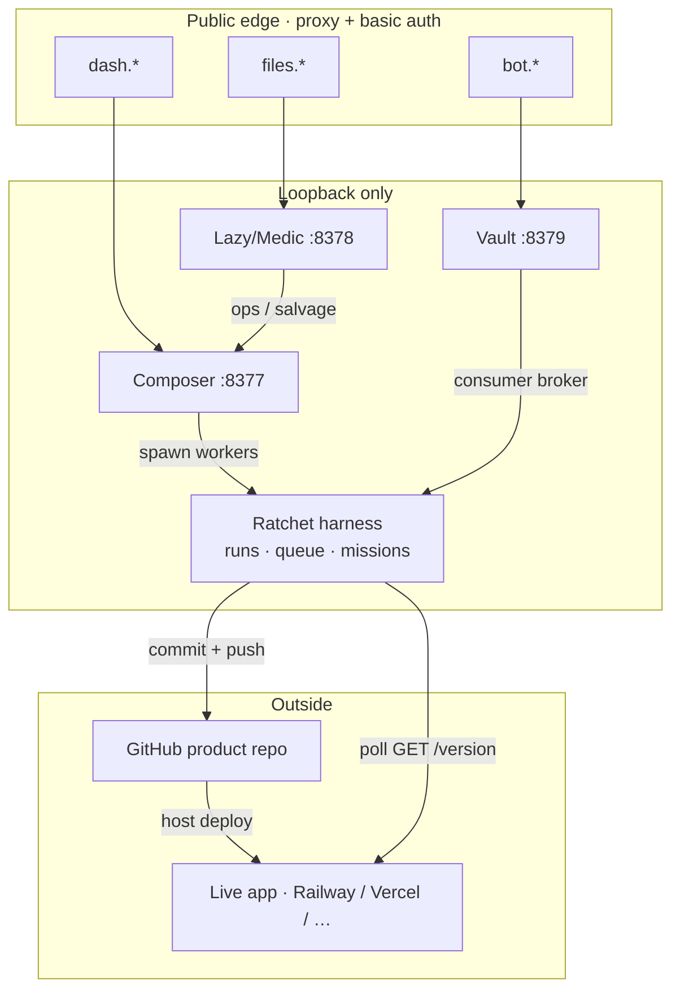
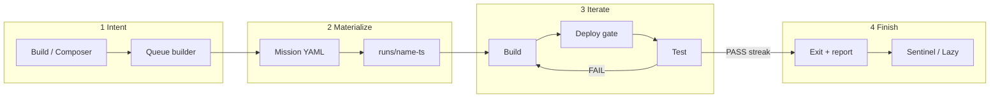

# Architecture

← [Overview](./overview.md) · [Index](./README.md) · Next: [Principles](./principles.md)

---

## System map



ASCII fallback:

```
edge (dash / files / bot)
   → Composer :8377 · Lazy :8378 · Vault :8379
        → Ratchet harness → GitHub → Live (/version)
```

Gallery: [diagrams.md](./diagrams.md)

---

## Trust boundaries

| Zone                       | Who                     | Trust rules                                                          |
| -------------------------- | ----------------------- | -------------------------------------------------------------------- |
| **Browser (human)**        | Human                   | Basic auth at edge; treat as privileged                              |
| **Loopback control plane** | Composer / Lazy / Vault | Bind `127.0.0.1` only; edge is the only public face                  |
| **Builder workspace**      | Claude CLI              | Can edit product repo; **no** vault secrets in env                   |
| **Tester workspace**       | Grok CLI                | Prefer read-only; only **live_url**, not local builder tree as truth |
| **Vault consumer**         | Harness / provisioner   | Short-lived arm + key file; never log secret values                  |
| **Product live**           | Public users            | Must expose `/version` without control-plane basic auth              |

**Edge detail (Composer admin):** some write APIs treat “loopback peer” as trusted. If you put Composer behind a reverse proxy, **do not** forward `X-Forwarded-For` / `X-Real-IP` in a way that makes remote clients look local _if_ your code keys off peer address — or redesign auth properly.

---

## End-to-end data flow



### 1. Intent capture

1. Human opens Build (`/`) or Composer (`/composer`).
2. Types a goal (optional image attachments on Build).
3. **Queue builder** turns prose into one or more queue items scoped to a **project folder** (`acme`, `composer`, …).

### 2. Mission materialization

1. Queue item → mission YAML (name, repo, live_url, acceptance, models, limits).
2. Optional: `architect` / `provision` steps consult Vault (e.g. Railway ensure).
3. Run directory created: `runs/<name>-<timestamp>/`.

### 3. Loop iteration

1. **Build** — agent works in `builder/` checkout; commits; pushes `deploy.branch`.
2. **Deploy gate** — poll `live_url` + `version_endpoint` until SHA matches (or fixed-delay / command strategy).
3. **Test** — agent exercises live site; writes `shared/verdict.json`.
4. **PASS** → streak++; **FAIL** → streak=0, next build prompt = tester’s `builder_prompt`.

### 4. Completion

1. Exit code + `shared/report.md` + cost JSON.
2. Queue item marked succeeded / failed / hard-fail.
3. Sentinel / Lazy may requeue, quarantine, or surface alerts — **without** implementing product features themselves.

---

## Process model (roles)

| Role                         | Typical entry                         | Notes                                              |
| ---------------------------- | ------------------------------------- | -------------------------------------------------- |
| Composer server              | `python3 server.py`                   | Restarts must leave detached workers alive         |
| Detached `ratchet __worker`  | child of composer launch path         | Must outlive Admin Apply / control-plane restarts  |
| Sentinel                     | `python3 -m sentinel`                 | Optional supervisor; can be armed/disarmed         |
| Lazy / Medic                 | `python3 -m lazy.web.server`          | CORS to dash origin for header toggle              |
| Vault                        | `python3 -m vault.server`             | Encrypted data dir                                 |

---

## Adapter matrix

The harness roles are pluggable:

```yaml
adapters: mock # all simulated
# or
adapters:
  builder: real
  tester: real
  deploy: real
```

| Role    | Mock                 | Real (typical)                           |
| ------- | -------------------- | ---------------------------------------- |
| builder | scripted “work”      | Claude CLI + git proof-of-work           |
| deploy  | instant / scenario   | version-endpoint / fixed-delay / command |
| tester  | scenario file line N | Grok against live_url + verdict schema   |

Mix roles while rolling out (e.g. real builder + mock tester).

---

## Where state lives

Paths use the illustrative root `RATCHET_ROOT` — rename to match your install.

| State                     | Location                                                              |
| ------------------------- | --------------------------------------------------------------------- |
| Queue items               | `RATCHET_ROOT/harness/composer-queue/<folder>-*.json`                 |
| Run workspaces            | `RATCHET_ROOT/harness/runs/<name>-<ts>/`                              |
| Mission templates / seeds | `RATCHET_ROOT/harness/missions/`                                      |
| Project shells            | `RATCHET_ROOT/projects/<slug>/project.json`                           |
| Sentinel state            | `RATCHET_ROOT/harness/composer-sentinel/`                             |
| Vault ciphertext          | vault-mode `data/` (0700, gitignored)                                 |
| Service env               | `RATCHET_ROOT/control/composer.env` + `secrets.env`                   |

Continue → [Principles](./principles.md)
