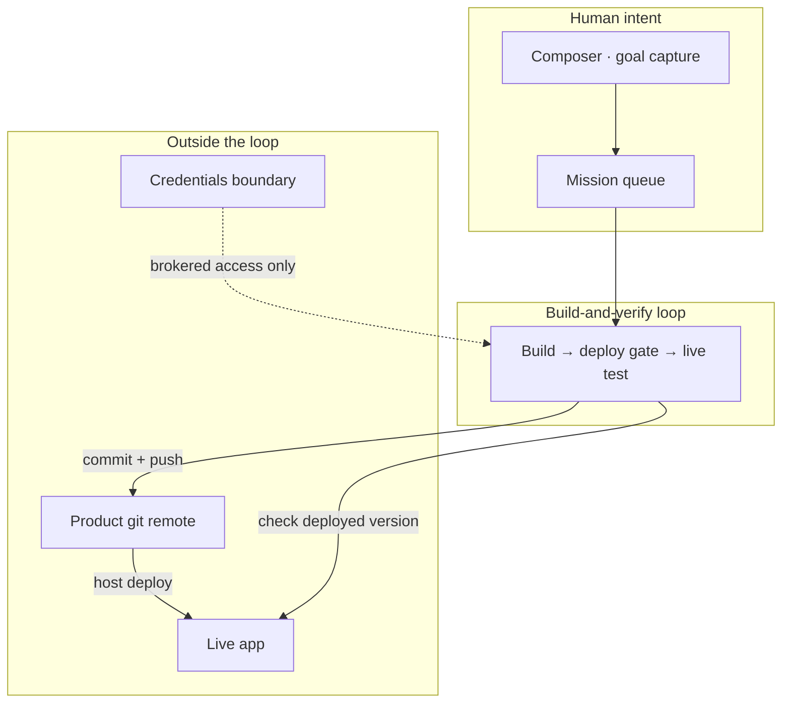
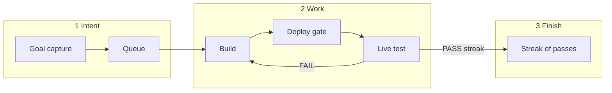

# Architecture

← [Overview](./overview.md) · [Index](./README.md) · Next: [Principles](./principles.md)

---

## System map

At product level, Ratchet is four cooperating ideas:



ASCII fallback:

```
Human goal → Composer → Queue → Build-and-verify loop
                                  ├→ push product repo
                                  ├→ wait for live version signal
                                  └→ test the live app only
```

Gallery: [diagrams.md](./diagrams.md)

---

## Trust boundaries (product ideas)

| Zone                     | Who                 | Product rule                                                |
| ------------------------ | ------------------- | ----------------------------------------------------------- |
| **Human + Composer**     | Operator            | Captures goals, owns the queue of missions                  |
| **Builder workspace**    | Coding agent        | May edit the product repo; never holds cloud secrets        |
| **Tester workspace**     | Tester agent        | Judges the **live** app only — not the builder’s local tree |
| **Credentials boundary** | Harness-side broker | Short-lived, named actions — tokens never enter agent env   |
| **Product live**         | Public users        | Exposes an honest version signal the loop can wait on       |

Secrets stay out of agent prompts and builder/tester environments. That boundary is the architecture; how any one install implements it is private.

---

## End-to-end product flow



### 1. Intent

A human describes product work. The control plane turns that into one or more focused missions scoped to a product — not one mega-mission for a multi-part goal.

### 2. Build → deploy gate → test

1. **Build** — a coding agent changes the product repo and pushes the deploy branch.
2. **Deploy gate** — the loop waits until the **live** app reports the same version the builder just pushed.
3. **Test** — a tester agent exercises the live site and returns pass or fail with actionable feedback.

### 3. Finish

The run ends only after a **streak** of consecutive passes. A single fail resets the streak. Durable notes stay with the campaign so the next iteration knows what still fails.

---

## Pluggable roles (concept)

The loop has three replaceable roles:

| Role            | Purpose                                              |
| --------------- | ---------------------------------------------------- |
| **Builder**     | Change product code and prove real git work happened |
| **Deploy gate** | Wait until live version matches what was pushed      |
| **Tester**      | Grade the live URL only; emit structured pass/fail   |

Early development can simulate any role; production-minded installs use real agents against a real live URL. Mixing simulated and real roles is a rollout technique, not a host recipe.

---

## Where product state _conceptually_ lives

No install paths here — only the ideas:

| State             | Product idea                                 |
| ----------------- | -------------------------------------------- |
| Queue             | Ordered missions per product                 |
| Run workspace     | One isolated workspace per mission attempt   |
| Product shell     | Repo + live URL + version URL bound together |
| Credentials store | Encrypted secrets outside agent workspaces   |

Continue → [Principles](./principles.md)
