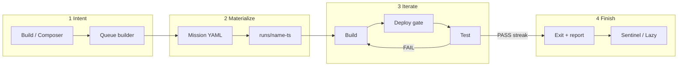

# Architecture

← [Overview](./overview.md) · [Index](./README.md) · Next: [Principles](./principles.md)

---

## System map


ASCII fallback:

```
nginx (dash / files / bot)
   → Composer :8377 · Lazy :8378 · Vault :8379
        → Ratchet harness → GitHub → Live (/version)
```

Gallery: [diagrams.md](./diagrams.md)

---

## Trust boundaries

| Zone                       | Who                     | Trust rules                                                          |
| -------------------------- | ----------------------- | -------------------------------------------------------------------- |
| **Browser (operator)**     | Human                   | Basic auth at edge; treat as privileged                              |
| **Loopback control plane** | Composer / Lazy / Vault | Bind `127.0.0.1` only; nginx is the only public face                 |
| **Builder workspace**      | Claude CLI              | Can edit product repo; **no** vault secrets in env                   |
| **Tester workspace**       | Grok CLI                | Prefer read-only; only **live_url**, not local builder tree as truth |
| **Vault consumer**         | Harness / provisioner   | Short-lived arm + key file; never log secret values                  |
| **Product live**           | Public users            | Must expose `/version` without control-plane basic auth              |

**Important nginx detail (Composer admin):** some write APIs treat “loopback peer” as trusted. If you put Composer behind nginx, **do not** forward `X-Forwarded-For` / `X-Real-IP` in a way that makes remote clients look non-local _if_ your code keys off peer address — or redesign auth properly. Production chose: authenticated remote users effectively on-host for Admin by not sending client IP headers to :8377.

---

## End-to-end data flow



### 1. Intent capture

1. Operator opens Build (`/`) or Composer (`/composer`).
2. Types a goal (optional image attachments on Build).
3. **Queue builder** turns prose into one or more queue items scoped to a **project folder** (`acme`, `composer`, …).

### 2. Mission materialization

1. Queue item → mission YAML (name, repo, live_url, acceptance, models, limits).
2. Optional: `architect` / `provision` steps consult Vault (e.g. Railway ensure).
3. Run directory created: `runs/<name>-<timestamp>/`.

### 3. Loop iteration

1. **Build** — agent works in `builder/` checkout; commits; pushes `deploy.branch`.
2. **Deploy gate** — poll `live_url` + `version_endpoint` until SHA matches (or fixed-delay / command strategy).
3. **Test** — agent exercises live site; writes `shared/verdict.json`.
4. **PASS** → streak++; **FAIL** → streak=0, next build prompt = tester’s `builder_prompt`.

### 4. Completion & ops

1. Exit code + `shared/report.md` + cost JSON.
2. Queue item marked succeeded / failed / hard-fail.
3. Sentinel / Lazy may requeue, quarantine, or wake operators — **without** implementing product features themselves.
4. Optional **operator sidecar** (Grok Build CLI): poll **~2 min until clean**, then **~10 min until done** — ops heal only; see [operations.md](./operations.md#operator-sidecar-grok-build-babysit).

---

## Process model (production)

| Process                      | Manager                       | Notes                                              |
| ---------------------------- | ----------------------------- | -------------------------------------------------- |
| `server.py` (Composer)       | `ratchet-composer.service`    | **`KillMode=process`** so workers survive restarts |
| Detached `ratchet __worker`  | child of composer launch path | Must outlive Admin Apply / systemctl restart       |
| `python3 -m sentinel`        | `ratchet-sentinel.service`    | Babysits; can be armed/disarmed                    |
| `python3 -m lazy.web.server` | `ratchet-lazy.service`        | CORS to dash origin for header toggle              |
| `python3 -m vault.server`    | `ratchet-vault.service`       | Encrypted data dir                                 |
| `ttyd` → `grok`              | `ratchet-console.service`     | Operator console                                   |
| Optional heal timer          | `ratchet-ops-heal.timer`      | Small blast radius checks every few minutes        |

---

## Adapter matrix

The harness roles are pluggable:

```yaml
adapters: mock # all simulated
# or
adapters:
  builder: real
  tester: real
  deploy: real
```

| Role    | Mock                 | Real (typical)                           |
| ------- | -------------------- | ---------------------------------------- |
| builder | scripted “work”      | Claude CLI + git proof-of-work           |
| deploy  | instant / scenario   | version-endpoint / fixed-delay / command |
| tester  | scenario file line N | Grok against live_url + verdict schema   |

Mix roles while rolling out (e.g. real builder + mock tester).

---

## Where state lives

| State                     | Location                                                              |
| ------------------------- | --------------------------------------------------------------------- |
| Queue items               | `/srv/ratchet/harness/composer-queue/<folder>-*.json`                 |
| Run workspaces            | `/srv/ratchet/harness/runs/<name>-<ts>/`                              |
| Mission templates / seeds | `/srv/ratchet/harness/missions/`                                      |
| Project shells            | `/srv/ratchet/projects/<slug>/project.json`                           |
| Sentinel state            | `/srv/ratchet/harness/composer-sentinel/`                             |
| Vault ciphertext          | vault-mode `data/` (0700, gitignored)                                 |
| Service env               | `/srv/ratchet/control/composer.env` + `secrets.env`                   |
| Operator knowledge        | `/srv/ratchet/control/docs/operator/` (separate from this share pack) |

Continue → [Principles](./principles.md)
