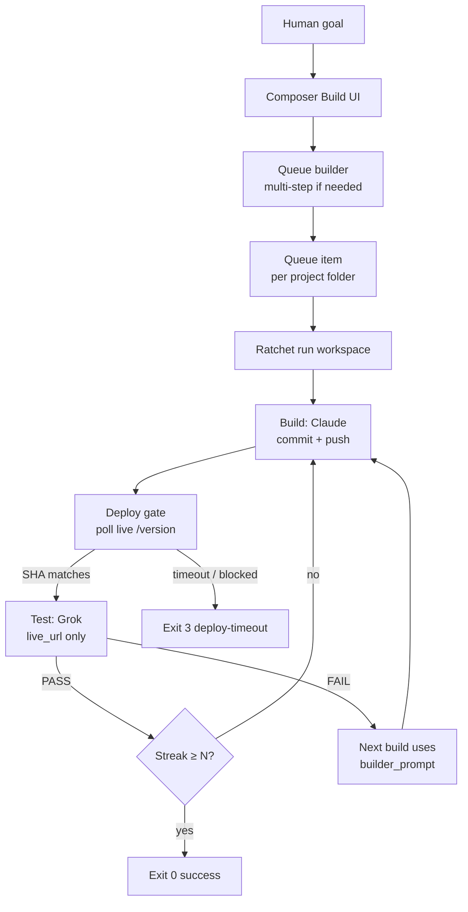
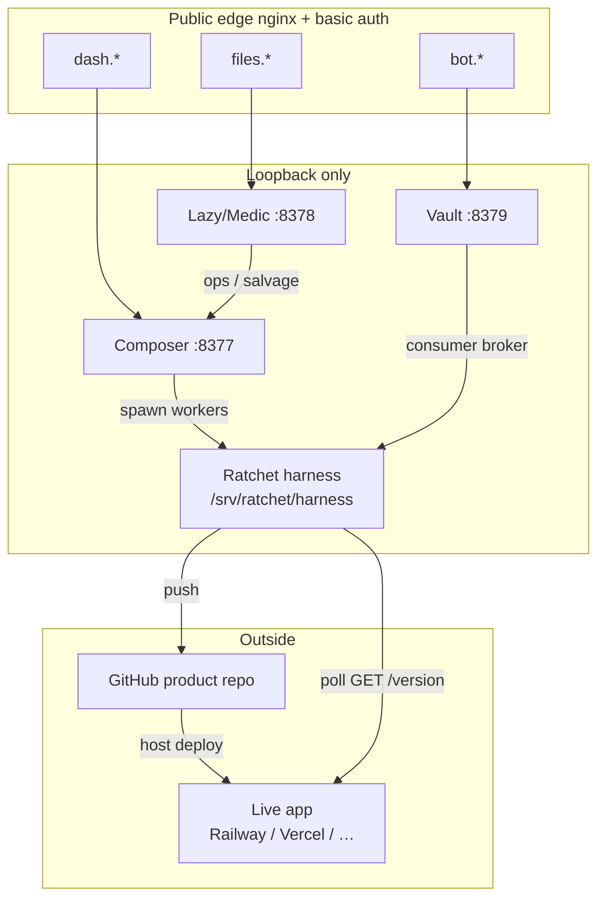
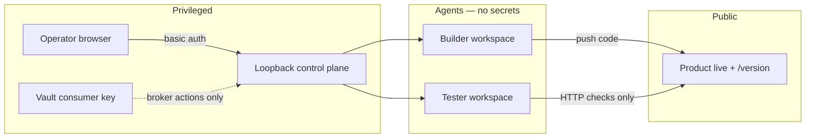
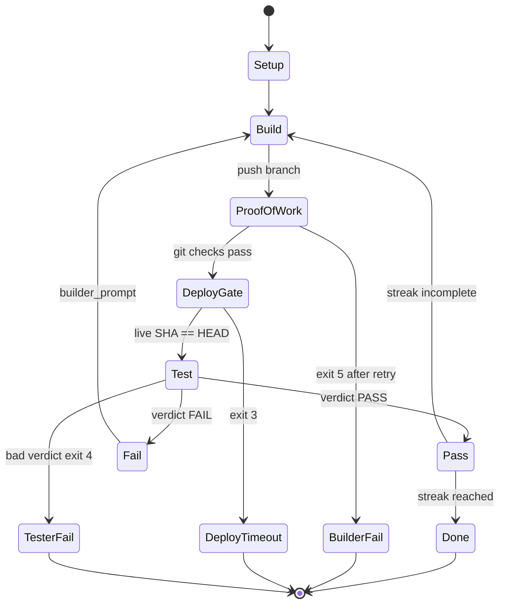
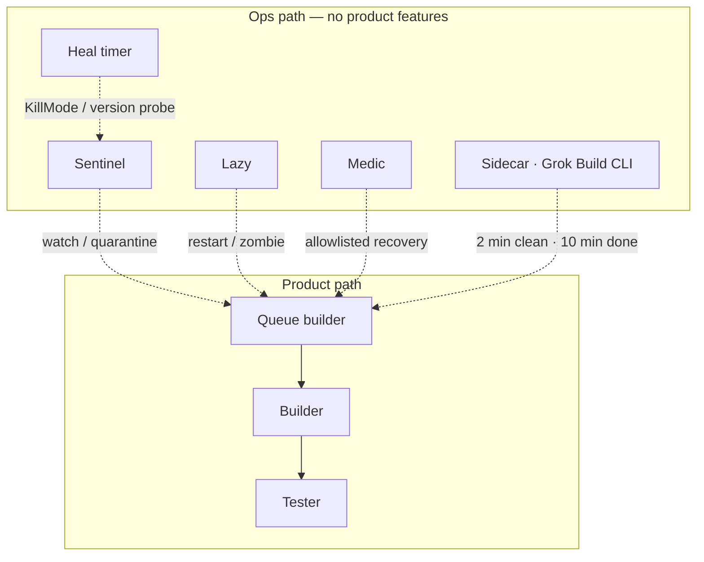
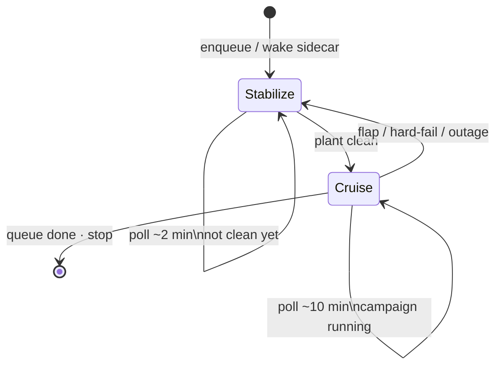
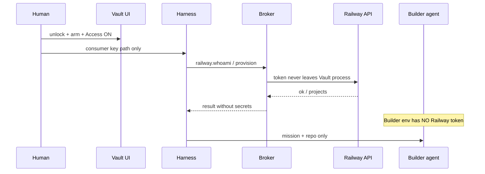
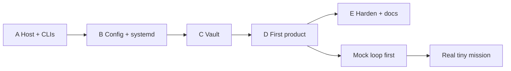

# Diagrams

← [Index](./README.md)

All major diagrams in one place (Mermaid). They render on GitHub and in many Markdown previews. The [printable one-pager HTML](./one-pager.html) carries the happy-path diagram as inline SVG so it prints with no external assets.

ASCII versions remain in [architecture.md](./architecture.md) for terminals that don’t render Mermaid.

---

## 1. Happy path (goal → done)

---

## 2. Control plane & edge

---

## 3. Trust boundaries

---

## 4. Single loop iteration

---

## 5. Who does what (ops vs product)

---

## 5b. Operator sidecar cadence

---

## 6. Secrets path (Vault)

---

## 7. Rebuild phases

---

## Print / export tips

| Goal               | Use                                                         |
| ------------------ | ----------------------------------------------------------- |
| Share on GitHub    | This file + others with Mermaid fences                      |
| One sheet of paper | Open [`one-pager.html`](./one-pager.html) → Print           |
| Terminal-only      | ASCII maps in architecture / overview                       |
| Slide paste        | Copy a single Mermaid block into Notion / Obsidian / slides |
