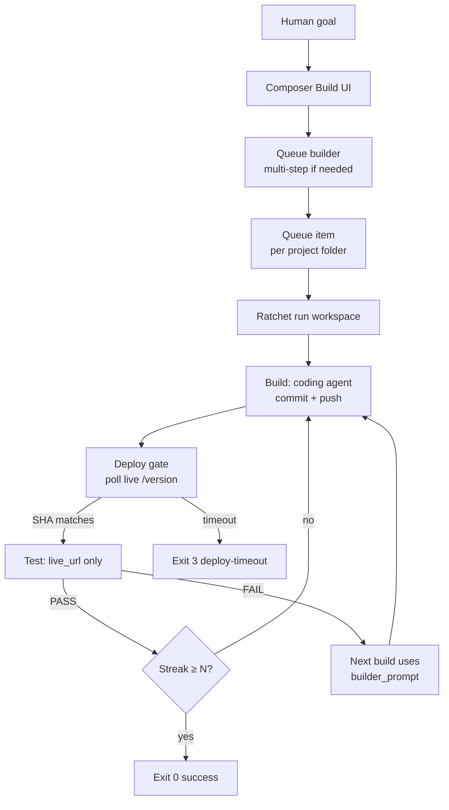
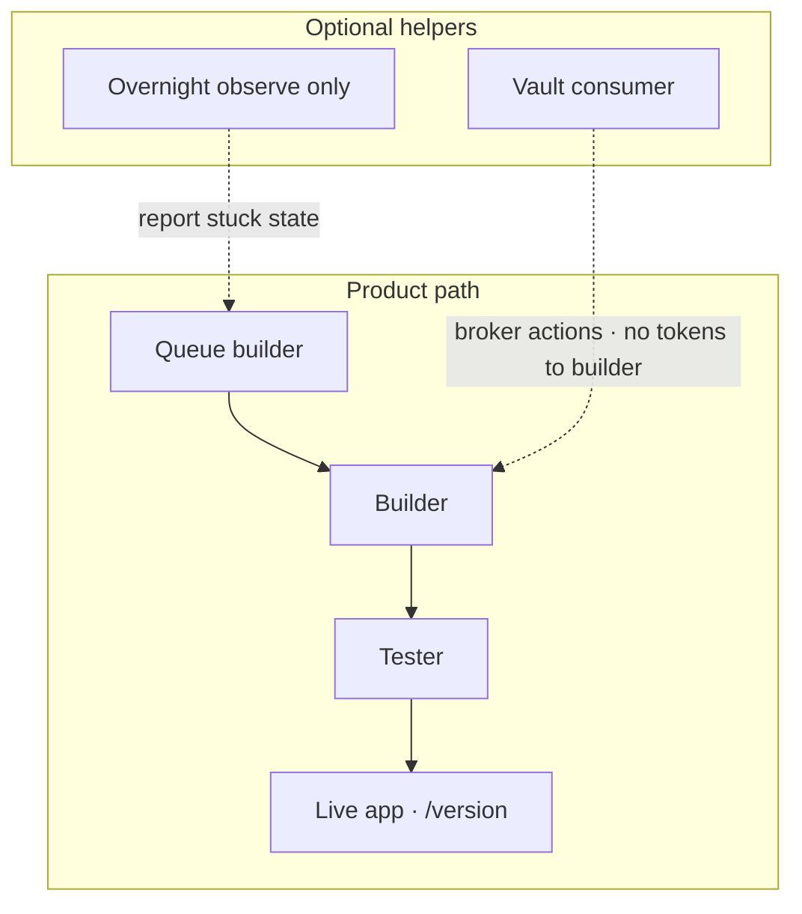
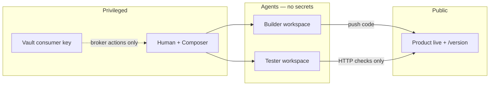
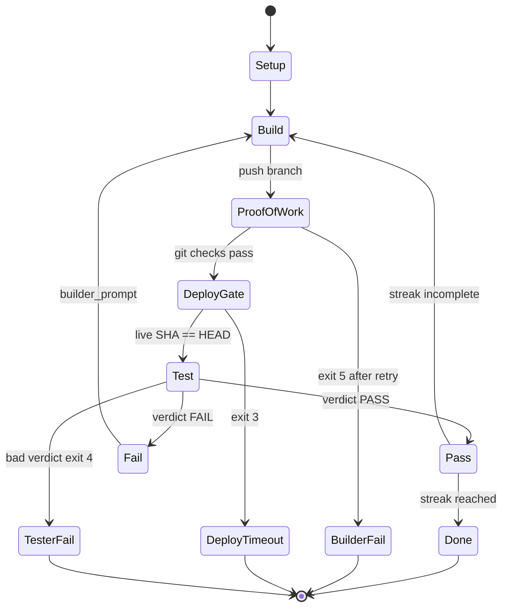
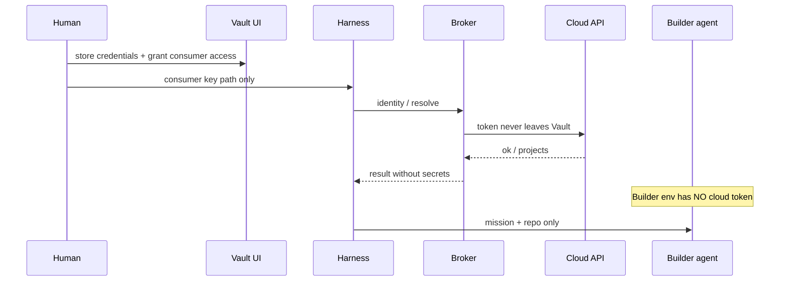
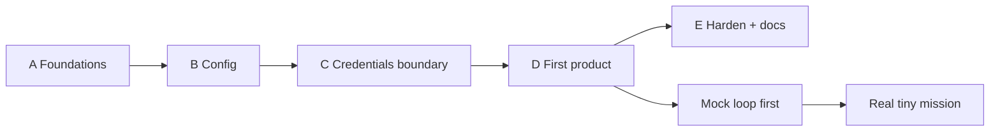

# Diagrams

← [Index](./README.md)

All major diagrams in one place (Mermaid). They render on GitHub and in many Markdown previews. The [printable one-pager HTML](./one-pager-print) carries the happy-path diagram as inline SVG so it prints with no external assets.

ASCII versions remain in [architecture.md](./architecture.md) for terminals that don’t render Mermaid.

---

## 1. Happy path (goal → done)

---

## 2. Product path vs helpers

---

## 3. Trust boundaries

---

## 4. Single loop iteration

---

## 5. Secrets path (Vault)

---

## 6. Rebuild phases

---

## Print / export tips

| Goal | Use |
| ---- | --- |
| Share on GitHub | This file + others with Mermaid fences |
| One sheet of paper | Open [`one-pager-print`](./one-pager-print) → Print |
| Terminal-only | ASCII maps in architecture / overview |
| Slide paste | Copy a single Mermaid block into Notion / Obsidian / slides |
