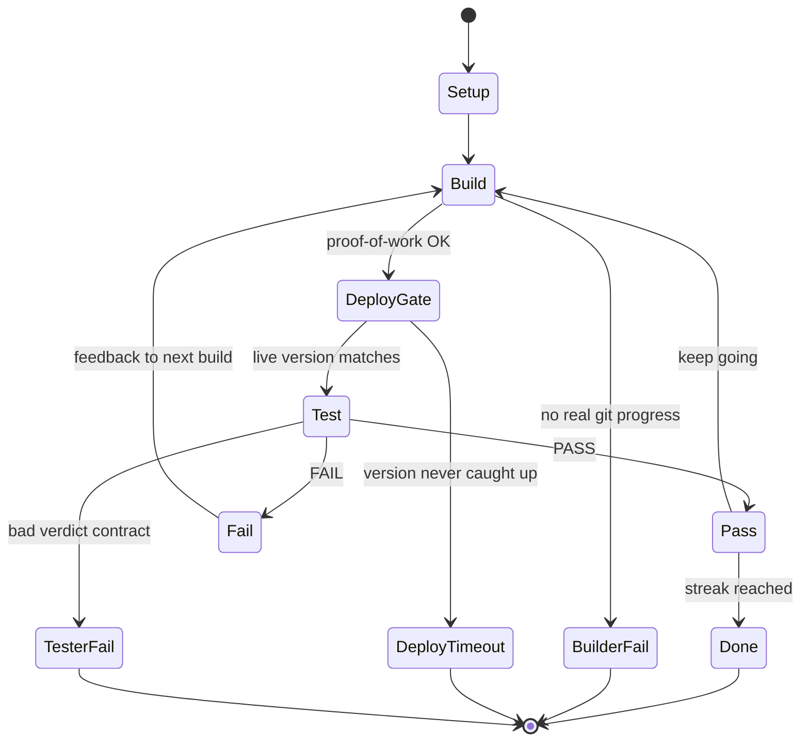

# Ratchet loop & missions

← [Layout](./layout.md) · [Index](./README.md) · Next: [Composer](./composer.md)

---

## Multi-step campaigns

A real product goal is often **many missions**, not one. Prefer several focused steps (roughly a handful) over a single mega-mission that “does everything.”

Why:

- Each step is easier to accept on the live site
- Failures are easier to resume
- Builders are less likely to partial-complete a giant brief

See [composer.md](./composer.md) for how the human surface turns a goal into a queue.

---

## The loop contract (product idea)



### Steps (ideas)

| Step | What it means |
| ---- | ------------- |
| Setup | Load the mission; create an isolated run workspace |
| Build | Coding agent changes the product; real commits and push |
| Deploy gate | Wait until live version matches what was pushed |
| Test | Exercise the **live** app; return structured pass/fail |
| Decide | PASS advances the streak; FAIL resets it. Stop on streak or limits |

### Outcomes (conceptual)

Runs end for product reasons such as:

- Success (required streak of consecutive passes)
- Iteration budget exhausted without a streak
- Deploy gate never saw the new version
- Tester returned an unusable result
- Builder never produced provable git work
- Spend budget exceeded

Exact exit numbers and CLI flags are install-private; the **meanings** are the public contract.

---

## Deploy gate and the version signal

The default honesty check is simple:

1. Builder pushes a known commit
2. Host deploys from git
3. Product serves a **version signal** that returns the currently deployed commit
4. Gate waits until that signal matches the push (or times out)

### Version signal contract (product)

Every product under this design should expose something equivalent to:

```http
GET /version
→ 200
→ body: deployed git SHA (plain text, or JSON carrying sha / version / commit)
```

Matching is case-insensitive; full SHA or a long-enough prefix is enough.

The path must be readable by the gate without control-plane login. If the version path is behind auth or always wrong, loops look “stuck” even when AI is fine.

Other gate strategies (fixed wait, custom command) exist as ideas for throwaways — production-minded products prefer an honest version signal.

---

## What a mission is

A mission is a **scoped unit of product work**:

| Field idea | Purpose |
| ---------- | ------- |
| Name | Human-readable label for the run |
| Repo + branch | Where the builder pushes |
| Live URL | What the tester grades |
| Version signal | What the gate polls |
| Mission text | What to change (and what not to touch) |
| Acceptance | Observable checks on the live app |
| Limits | Max iterations, required streak, optional spend cap |
| Roles | Which builder / tester / gate implementations to use |

A tiny illustrative shape (placeholders only):

```yaml
name: fix-homepage-cta
repo: https://git.example.com/you/app.git
live_url: https://www.example.com
version_endpoint: /version
mission: |
  Change the homepage CTA label to "Get started".
  Do not change pricing or auth.
acceptance:
  - GET / returns 200 with visible text "Get started"
  - /version returns the deployed git SHA
limits:
  max_iterations: 8
  consecutive_passes_required: 2
```

Field names and extras vary by install. The product idea is stable: **repo + live truth + acceptance + limits**.

---

## Optional prep steps (concept)

Some missions may plan or ensure infrastructure **before** build. Product rules:

- Treat planner output as untrusted input to an allowlist
- Prefer binding a known cloud project identity over creating new ones
- Fail closed when identity checks fail
- Leave optional ensure off until the core loop is reliable

No provisioner recipes or host steps live in this pack.

---

## Verdict contract (tester → loop)

The tester must return a structured result the loop can act on:

- Overall **PASS** or **FAIL**
- On FAIL: actionable feedback for the next builder iteration
- Open issues aligned with durable campaign notes

Missing or malformed results are a contract failure — not a silent green.

Continue → [Composer](./composer.md)
