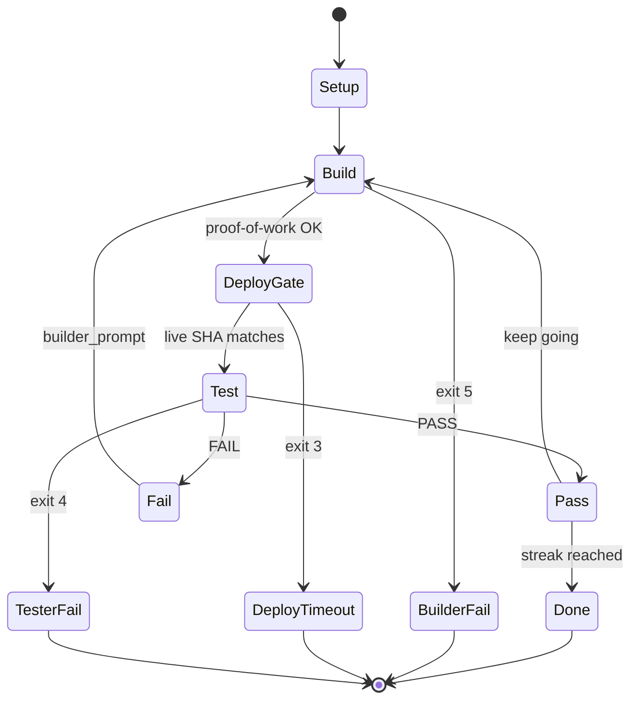

# Ratchet loop & missions

← [Layout](./layout.md) · [Index](./README.md) · Next: [Composer](./composer.md)

---

## Multi-step campaigns (Composer drafts)

A **campaign** is often many queue items, not one YAML. From Build home the planner should draft about **4–8** focused steps for a real product goal (each step becomes its own mission when loaded). One mega-mission that “does everything” is a footgun: hard to accept, hard to resume, easy for the builder to partial-complete.

See [composer.md](./composer.md) for queue-builder rules, resplit of thin drafts, and clear modes that keep the draft panel.

---

## The loop contract

Implemented in `lib/loop.sh`. Builder / deploy / tester steps are adapter functions.

**Definitions**

- **Iteration** — one full build → deploy → test cycle
- **Streak** — count of consecutive `PASS` verdicts



### Steps

| #   | Step        | What happens                                                                                      |
| --- | ----------- | ------------------------------------------------------------------------------------------------- |
| 0   | Setup       | Load mission; create `runs/<name>-<ts>/{builder,tester,shared,history}`                           |
| 1   | Build       | Iteration 1: mission text. Later: previous FAIL’s `builder_prompt`. Commit + push `deploy.branch` |
| 2   | Deploy gate | Wait until deploy is demonstrable (see strategies)                                                |
| 3   | Test        | Exercise **live_url**; write `shared/verdict.json`; update `TESTLOG.md`                           |
| 4   | Decide      | PASS → streak++; FAIL → streak=0. Stop when streak ≥ required or limits hit                       |

### Exit codes

| Code | Meaning                                                 |
| ---- | ------------------------------------------------------- |
| 0    | Success — streak reached `consecutive_passes_required`  |
| 1    | Usage/config/archive error                              |
| 2    | `max_iterations` without streak                         |
| 3    | Deploy gate timeout                                     |
| 4    | Tester contract failure / missing or bad `verdict.json` |
| 5    | Builder proof-of-work failure (after retry)             |
| 6    | Budget exceeded (`max_budget_usd`)                      |

CLI summary line example:

```text
summary: iterations=5 streak=2 reason=success cost_usd=14.43 exit=0
```

---

## Deploy strategies

Configured under `deploy.strategy`:

| Strategy                     | Behavior                                                            | When to use                                 |
| ---------------------------- | ------------------------------------------------------------------- | ------------------------------------------- |
| `version-endpoint` (default) | Poll `live_url` + `version_endpoint` until body matches pushed SHA  | Real products                               |
| `fixed-delay`                | Sleep N seconds, assume success                                     | Throwaways with no version URL              |
| `command`                    | Re-run shell command until exit 0 (`RATCHET_EXPECTED_SHA` exported) | `gh run watch` etc. (trusted missions only) |

### Version endpoint contract

Product must serve:

```http
GET /version
→ 200
→ body: deployed git SHA (plain text, or JSON with sha / version / commit)
```

Matching is case-insensitive; full SHA or 7+ char prefix.

**Must not require basic auth** for this path if the gate polls from the VPC unauthenticated. Open `/version` (and often `/health`) at the edge while leaving the rest protected.

Production hardening also short-circuits when GitHub deployment status says **“Deployment was blocked”** instead of waiting the full timeout.

---

## Minimal mission YAML

```yaml
name: fix-homepage-cta
repo: https://git.example.com/you/app.git
live_url: https://www.example.com
version_endpoint: /version

deploy:
  branch: main
  strategy: version-endpoint
  wait_timeout_seconds: 600
  poll_interval_seconds: 10

mission: |
  Change the homepage CTA label to "Get started".
  Do not change pricing or auth.

acceptance:
  - GET / returns 200 with visible text "Get started"
  - /version returns the deployed git SHA

builder:
  model: claude-opus-4-8 # must exist in your models registry / adapter map
tester:
  model: grok-4.5
  read_only: true

limits:
  max_iterations: 8
  consecutive_passes_required: 2
  max_budget_usd: 25

adapters:
  builder: real
  tester: real
  deploy: real
```

Full field documentation lives in `mission.schema.yaml` in the harness tree. That file is the source of truth for every key.

### Config flattening

`lib/config.sh` turns YAML into `RATCHET_*` environment variables, e.g.:

| YAML                | Env                                                     |
| ------------------- | ------------------------------------------------------- |
| `name: x`           | `RATCHET_NAME=x`                                        |
| `deploy.branch`     | `RATCHET_DEPLOY_BRANCH`                                 |
| `acceptance: [a,b]` | `RATCHET_ACCEPTANCE_COUNT=2`, `RATCHET_ACCEPTANCE_1`, … |

Parsing uses `yq` when present, else Python/PyYAML.

---

## Optional: architect + provision

Some missions add infra steps **before** build:

```text
architect → provision → build → test → deploy-gate
```

- **Architect** — plan (JSON); treated as untrusted input to provisioner allowlist
- **Provision** — Vault consumer actions (e.g. `railway.resolve_or_provision`)

Offline testing:

```bash
VAULT_MOCK=1 ARCHITECT_FORCE_DETERMINISTIC=1 \
  bin/ratchet run missions/some-bootstrap.yaml --scenario fixtures/scenarios/happy.txt
```

---

## CLI quick reference

```bash
# zero-cost full loop
bin/ratchet run missions/mock-loop.yaml --scenario fixtures/scenarios/happy.txt

# dry-run resolve
bin/ratchet run missions/example-debug.yaml --dry-run

# real builder against local fixture
fixtures/make-target-repo.sh
bin/ratchet run missions/builder-smoke.yaml

# status / kill
bin/ratchet status
bin/ratchet kill <run>
bin/ratchet report <run-dir>
```

---

## Verdict contract (tester → harness)

`shared/verdict.json` must be valid and include at least:

- overall result: `PASS` or `FAIL`
- on FAIL: actionable `builder_prompt` for the next iteration
- open bugs aligned with `TESTLOG.md` discipline

Malformed/missing verdict → exit 4 (contract violation).

Continue → [Composer](./composer.md)
