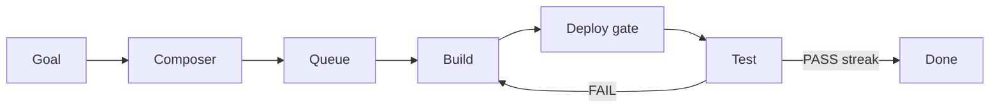

# Ratchet — one-pager

**Print tip:** For best results open [`one-pager-print`](./one-pager-print) and use **File → Print** (or Save as PDF). This Markdown page is the same content for editors that don’t open HTML.

---

## What it is

Self-hosted **AI build-and-verify control plane**. Human types a goal → system queues missions → AI **builder** pushes code → **deploy gate** waits for live version signal → AI **tester** grades the **live** site → repeat until a **streak** of passes. Name = contract: only moves forward.

---

## Happy path

---

## Stack (roles)

| Piece             | Place                | Job                               |
| ----------------- | -------------------- | --------------------------------- |
| Composer          | control plane UI     | Goals, queue, product shells      |
| Ratchet loop      | harness              | Build → gate → live test          |
| Vault             | credentials boundary | Secrets + brokered access         |
| Products          | product shells       | Repo + live URL + version signal  |
| Overnight helpers | optional             | Observe only; no product features |

---

## Non‑negotiables

1. **Live is truth** — tester hits the live URL, not the local tree
2. **Version signal** — product must return the deployed git SHA for the deploy gate
3. **Proof of work** — loop checks git; ignore agent claims
4. **Streak** — usually several consecutive passes
5. **No secrets in builder env** — credentials boundary only
6. **Team git author** — unknown bot authors may be blocked by hosts
7. **Multi-step goals** → several focused queue items; bind cloud project identities
8. **Credentials stay brokered** — builder and tester never hold cloud tokens

---

## Loop outcomes (concepts)

| Outcome               | Meaning                               |
| --------------------- | ------------------------------------- |
| Success               | Required streak of consecutive passes |
| Max iterations        | Budget of attempts exhausted          |
| Deploy timeout        | Live version never caught up          |
| Tester contract       | Missing or bad structured result      |
| Builder proof-of-work | No real git progress                  |
| Budget                | Spend limit exceeded                  |

---

## Mental model

**Composer** = factory office · **Ratchet** = factory floor · **Vault** = key cabinet · **Product version signal** = time clock.

---

## Rebuild in one breath

Model CLIs → control plane + harness + product shells → credentials boundary → mock loop → product with version signal → tiny real mission → docs pack for friends/AIs.

---

## Share / go deeper

| Need          | Open                             |
| ------------- | -------------------------------- |
| Full guide    | [README.md](./README.md)         |
| All diagrams  | [diagrams.md](./diagrams.md)     |
| Agent prompts | [ai-prompts.md](./ai-prompts.md) |
| Footguns      | [footguns.md](./footguns.md)     |
| Guide history | [CHANGELOG.md](./CHANGELOG.md)   |

_No secrets in this pack. Guide pack **v1.2** · product design reference only._
