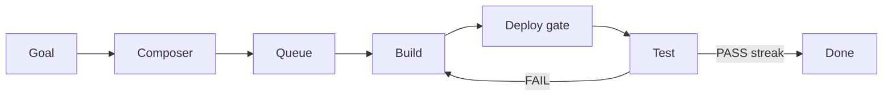

# Ratchet — one-pager

**Print tip:** For best results open [`one-pager-print`](./one-pager-print) and use **File → Print** (or Save as PDF). This Markdown page is the same content for editors that don’t open HTML.

---

## What it is

Self-hosted **AI build-and-verify control plane**. Human types a goal → system queues missions → AI **builder** pushes code → **deploy gate** waits for live `/version` SHA → AI **tester** grades the **live** site → repeat until a **streak** of passes. Name = contract: only moves forward.

---

## Happy path

---

## Stack (roles)

| Piece | Place | Job |
| ----- | ----- | --- |
| Composer | control plane UI | Goals, queue, projects |
| Ratchet CLI | `RATCHET_ROOT/harness` | Loop orchestration |
| Vault | credentials boundary | Secrets + consumer broker |
| Projects | `RATCHET_ROOT/projects` | `project.json` shells |
| Overnight helpers | optional | Observe only; no product features |

---

## Non‑negotiables

1. **Live is truth** — tester hits `live_url`, not local tree
2. **`/version`** — product must return deployed git SHA for the deploy gate
3. **Proof of work** — harness checks git; ignore agent claims
4. **Streak** — usually 2 consecutive PASSes
5. **No secrets in builder env** — Vault consumer only
6. **Team git author** — unknown bot authors may be blocked by hosts
7. **Multi-step goals** → about **4–8** queue items for real product work; bind cloud project UUIDs
8. **Credentials stay brokered** — builder and tester never hold cloud tokens

---

## Loop exits

| Code | Meaning |
| ---- | ------- |
| 0 | Success (streak) |
| 2 | Max iterations |
| 3 | Deploy timeout |
| 4 | Tester contract |
| 5 | Builder proof-of-work |
| 6 | Budget |

---

## Mental model

**Composer** = factory office · **Ratchet** = factory floor · **Vault** = key cabinet · **Product `/version`** = time clock.

---

## Rebuild in one breath

Host + model CLIs → trees `RATCHET_ROOT/{control,harness,projects}` → vault consumer → mock loop → product with `/version` → tiny real mission → docs pack for friends/AIs.

---

## Share / go deeper

| Need | Open |
| ---- | ---- |
| Full guide | [README.md](./README.md) |
| All diagrams | [diagrams.md](./diagrams.md) |
| Agent prompts | [ai-prompts.md](./ai-prompts.md) |
| Footguns | [footguns.md](./footguns.md) |
| Guide history | [CHANGELOG.md](./CHANGELOG.md) |

_No secrets in this pack. Guide pack **v1.2** · product design reference only._
