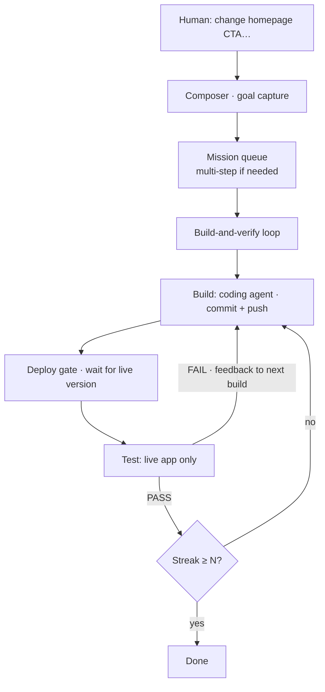

# Overview

← [Index](./README.md) · Next: [Architecture](./architecture.md)

---

## Elevator pitch

Ratchet is a **control plane for AI software work** that refuses to declare victory until the **live site** agrees.



ASCII (terminals without Mermaid):

```
Human goal → Composer → Queue → Build → Deploy gate → Test
                              ↑              │
                              └──── FAIL ────┘
                                    PASS streak → done
```

The name is the contract: like a mechanical ratchet, the loop only moves forward. Open issues stay visible until fixed. The run ends only after N consecutive clean passes against the deployed app.

More diagrams: [diagrams.md](./diagrams.md) · Printable: [one-pager-print](./one-pager-print)

---

## Component cheat sheet

| Component | Role |
| --------- | ---- |
| **Composer** | Human-facing surface: capture goals, manage product shells, queue missions |
| **Ratchet loop** | Orchestration: builder → deploy gate → live tester → streak |
| **Credentials boundary** | Secrets stay brokered; agents never hold cloud tokens |
| **Product shells** | One product = one repo + one live URL + one version signal |
| **Optional helpers** | Observe and report only — never implement product features |

---

## What “done” means

| Layer | Done when |
| ----- | --------- |
| Single mission | A streak of consecutive live passes |
| Deploy gate | Live version signal matches what the builder just pushed |
| Builder step | Real git work is proven — not agent claims alone |
| Product campaign | Each focused step succeeded (or was intentionally dropped) |

---

## What this system is _not_

- Not a general chat UI for product end users
- Not a drop-in replacement for CI (it pairs with whatever deploys from git)
- Not “overnight helpers ship features” — builders change product code
- Not a place to put secrets in agent prompts
- Not a host operations runbook (see [operations.md](./operations.md) for pack scope)

---

## Suggested first hour (reading)

1. Skim [principles.md](./principles.md)
2. Read [loop-and-missions.md](./loop-and-missions.md) until the live-version contract is clear
3. Skim [footguns.md](./footguns.md) for the common design mistakes
4. Only then decide how *your* install would realize the same product ideas

Continue → [Architecture](./architecture.md)
