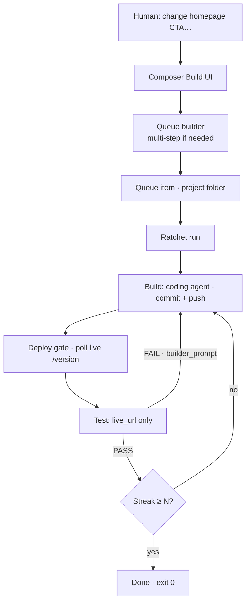

# Overview

← [Index](./README.md) · Next: [Architecture](./architecture.md)

---

## Elevator pitch

Ratchet is a **control plane for AI software work** that refuses to declare victory until the **live site** agrees.



ASCII (terminals without Mermaid):

```
Human goal → Composer → Queue → Build → Deploy gate → Test
                              ↑              │
                              └──── FAIL ────┘
                                    PASS streak → done
```

The name is the contract: like a mechanical ratchet, the loop only moves forward. Bugs stay on the books in `TESTLOG.md` until fixed. The run ends only after N consecutive clean passes against the deployed app.

More diagrams: [diagrams.md](./diagrams.md) · Printable: [one-pager-print](./one-pager-print)

---

## Component cheat sheet

| Component | Role |
| --------- | ---- |
| **Composer** | Human UI: Build home, projects, queue, dashboard, assist |
| **Ratchet CLI** | Orchestration loop (builder / deploy gate / tester) under `RATCHET_ROOT/harness` |
| **Vault** | Encrypted credentials; consumer broker so harness actions never put tokens in builder env |
| **Projects** | One folder per product (`project.json` + optional clone) under `RATCHET_ROOT/projects/<slug>` |
| **Lazy / Medic / Sentinel** | Optional overnight helpers — observe and report only; never implement product features |

---

## What “done” means

| Layer | Done when |
| ----- | --------- |
| Single mission | Streak of `PASS` verdicts ≥ `limits.consecutive_passes_required` |
| Deploy gate | Live `version_endpoint` returns builder’s pushed SHA |
| Builder step | Git proof-of-work: real commits, ancestry ok, remote HEAD matches |
| Product queue | Each step succeeded (or discarded intentionally) |

---

## What this system is _not_

- Not a general chat UI for product users
- Not a CI replacement (though it pairs with host deploy pipelines)
- Not “overnight helpers implement features” — builders implement product
- Not a place to put secrets in agent prompts or builder env
- Not a host operations runbook (see [operations.md](./operations.md) for pack scope)

---

## Suggested first hour

1. Skim [principles.md](./principles.md)
2. Run a **mock** loop ([examples.md](./examples.md)) — zero API cost
3. Read [loop-and-missions.md](./loop-and-missions.md) until `/version` makes sense
4. Only then wire real CLIs and a throwaway product

Continue → [Architecture](./architecture.md)
