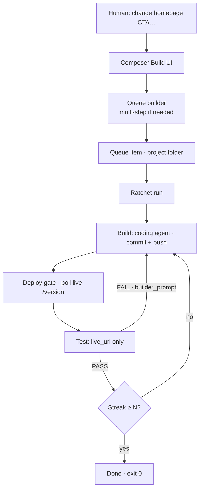

# Overview

← [Index](./README.md) · Next: [Architecture](./architecture.md)

---

## Elevator pitch

Ratchet is a **control plane for AI software work** that refuses to declare victory until the **live site** agrees.



ASCII (terminals without Mermaid):

```
Human goal → Composer → Queue → Build → Deploy gate → Test
                              ↑              │
                              └──── FAIL ────┘
                                    PASS streak → done
```

The name is the contract: like a mechanical ratchet, the loop only moves forward. Bugs stay on the books in `TESTLOG.md` until fixed. The run ends only after N consecutive clean passes against the deployed app.

More diagrams: [diagrams.md](./diagrams.md) · Printable: [one-pager-print](./one-pager-print)

---

## Component cheat sheet

| Component       | Role                                                            | Default bind (illustrative)        |
| --------------- | --------------------------------------------------------------- | ---------------------------------- |
| **Composer**    | Human UI: Build home, projects, queue, dashboard, admin, assist | `127.0.0.1:8377`                   |
| **Sentinel**    | Supervisor: arm/disarm, watch composer/queue health             | no public port                     |
| **Lazy Mode**   | Independent overnight watchdog (observe)                        | `127.0.0.1:8378`                   |
| **Medic**       | Recovery console for queues (on Lazy host, `/medic`)            | same as Lazy                       |
| **Vault**       | Master-password credentials; broker for cloud APIs              | `127.0.0.1:8379`                   |
| **Ratchet CLI** | Orchestration loop (builder / deploy gate / tester)             | `RATCHET_ROOT/harness`             |
| **Projects**    | One folder per product (`project.json` + optional clone)        | `RATCHET_ROOT/projects/<slug>`     |

All control-plane HTTP is **loopback only** in the reference design. Public access is typically an edge proxy with TLS + basic auth (e.g. `dash.*`, `files.*`, `bot.*` placeholders).

---

## What “done” means

| Layer          | Done when                                                             |
| -------------- | --------------------------------------------------------------------- |
| Single mission | Streak of `PASS` verdicts ≥ `limits.consecutive_passes_required`      |
| Deploy gate    | Live `version_endpoint` returns builder’s pushed SHA                  |
| Builder step   | Git proof-of-work: real commits, ancestry ok, remote HEAD matches     |
| Product queue  | Each step succeeded (or discarded intentionally); no stuck `running`  |

---

## What this system is _not_

- Not a general chat UI for product users
- Not a CI replacement (though it pairs with host deploy pipelines)
- Not “Medic implements features” — Medic recovers queue state; builders implement product
- Not a place to put secrets in agent prompts or builder env

---

## Suggested first hour

1. Skim [principles.md](./principles.md)
2. Run a **mock** loop ([examples.md](./examples.md)) — zero API cost
3. Read [loop-and-missions.md](./loop-and-missions.md) until `/version` makes sense
4. Only then wire real CLIs and a throwaway product

Continue → [Architecture](./architecture.md)
